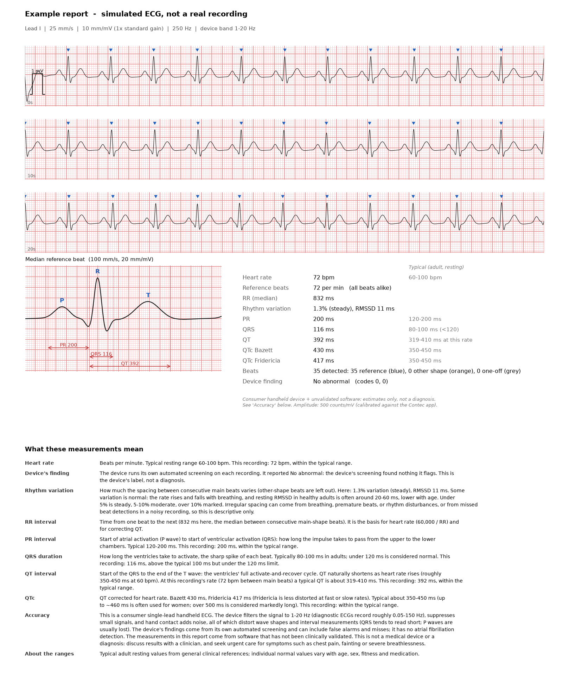

# emg10-ecg

**Get your recordings off an EMAY EMG-10 handheld ECG without the vendor app, and turn them into
readable, labelled ECG reports.**

The EMG-10 (a rebadged **Contec PM10**) stores 30-second single-lead recordings and talks to a
computer over an undocumented USB HID protocol. This project decodes that protocol, downloads every
recording to CSV, and renders each one as an ECG-paper report with interval measurements and
plain-language explanations.

**Why this exists:** the vendor's Mac app ("Portable ECG Monitor") is an Intel-only build that relies
on Rosetta 2 and will not open on macOS 28 or later. EMAY's newer "EMAY ECG HD" app recognises the
device but rejects it, because it speaks a different protocol. This project runs natively on Apple
silicon, so an EMG-10 / PM10 stays readable after the vendor software stops working. (It is tested on
macOS only; the USB library also supports Linux and Windows, but those are untested.)

**Intended use:** educational and research software that lets technically skilled users inspect data
from their own device. It is not intended for diagnosis, treatment, monitoring, or any other clinical
or medical use. See [DISCLAIMER.md](DISCLAIMER.md).

The device's user manual (as the Contec PM10) is available on
[ManualsLib](https://www.manualslib.com/guide/2991328/contec-pm10-portable-ecg-monitor-manual.html).


<sub>Example report generated from a <b>simulated</b> ECG (`tools/make_example.py`), not a real recording.</sub>

## Features

- **Direct USB download**: no vendor software. Sets the device clock, lists every stored recording,
  and resumes automatically when the device powers itself off mid-transfer.
- **Read-only by design**: sends only the handful of commands observed from the vendor app. It never
  writes settings and never sends anything that could delete recordings.
- **ECG-paper reports**: 25 mm/s strips on a 1 mm / 5 mm grid, calibrated in mV, with a 1 mV
  calibration pulse.
- **Beat analysis**: detects beats, groups them by shape (main beats, recurring other shapes, one-off
  shapes), and builds a median beat.
- **Interval estimates**: PR, QRS, QT and QTc (Bazett and Fridericia), each shown next to its typical
  adult range. QT's range is computed for the recording's heart rate.
- **The device's own findings**, decoded (e.g. "Missed Beat", "VPB Bigeminy", "Arrhythmia") and explained.
- **Honest about uncertainty**: measurements that can't be made reliably are withheld with a reason,
  and noisy stretches are flagged for review, never silently dropped.

## Quick start

This project is provided as **source code for technically skilled users**, with no packaged app,
installer or support.

- **Tested on:** macOS (Apple silicon), Python 3.13, with the library versions pinned in
  `requirements.txt`. Linux and Windows are untested.
- **Your responsibility:** reading the code, deciding whether it suits your purpose, and setting up
  a hardware and software environment that can run it. Differences in operating system, Python,
  library versions or USB hardware can change results; each report records the versions that
  produced it.
- **Methods and known limitations** are documented in the module docstrings and under
  [Limitations](#limitations).

```bash
pip install -r requirements.txt

python download.py            # turn the EMG-10 on and plug in USB when prompted
```

On first run you'll be shown [DISCLAIMER.md](DISCLAIMER.md) and asked to type `I UNDERSTAND` (or pass
`--accept-disclaimer` in scripts). Acceptance is stored per user in `~/.config/emg10-ecg/` and is
asked for again if the disclaimer changes.

Recordings are saved to `recordings/` as `YYYYmmdd_HHMMSS_hrNN.csv` (raw samples) and a matching `.png`
report, plus an `index.csv` of every recording's header.

| Command | What it does |
|---|---|
| `python download.py` | Sync the clock, then download every recording not already saved |
| `python download.py --list` | Sync the clock and list recordings (date, heart rate, device finding) |
| `python download.py --record 1 3` | Download specific recordings (1 = newest) |
| `python download.py --replot` | Regenerate all PNGs from saved CSVs; no device needed |
| `python download.py --out DIR` | Save somewhere other than `recordings/` |
| `python download.py --accept-disclaimer` | Record acceptance of the disclaimer without the interactive prompt |

> The EMG-10 switches itself off after about 30 seconds of idle and after a few minutes even while
> transferring. If that happens the downloader waits; wake the device and it carries on.

## How it works

The device enumerates as a Nuvoton "HID Transfer" device (`4444:5555`) exchanging 64-byte reports.
The protocol was recovered by tracing the Contec macOS app with lldb (see `tools/`):

| Host → device | Device → host | Meaning |
|---|---|---|
| `81` | `f1 …` | Identify |
| `82 Y Y M D h m s` | `f2` (echo) | Set clock |
| `90` | `e0 n` | Number of stored recordings |
| `fe` | `e1 …` | Next recording header: date, sample count, heart rate, finding codes |
| `a0 lo hi` | 300 × `d0 …` | Download a recording: 7,500 samples, 25 per packet |
| `a0 7f 7f` | – | End session |

Data bytes are 7-bit; multi-byte values are big-endian groups of 7 bits. Samples are 14-bit at
250 Hz with a baseline of 8192 and a scale of 500 counts per mV. Full details are in `emg10.py`.

## Project layout

| Path | Purpose |
|---|---|
| `emg10.py` | USB protocol, recording headers, device-finding codes |
| `download.py` | Command-line downloader and report generation |
| `ecg_analysis.py` | Beat detection (NeuroKit2), shape grouping, median beat, intervals |
| `ecg_plot.py` | ECG-paper report rendering |
| `ecg_explain.py` | Plain-language explanations and typical ranges |
| `environment.py` | Records the software versions behind each report and `index.csv` row |
| `acknowledge.py` | One-time disclaimer acceptance (stored per user, re-asked if the disclaimer changes) |
| `tools/` | HID capture/probe utilities from the reverse engineering, and the example generator |

## Limitations

The EMG-10 filters its signal to **1-20 Hz** in firmware and zeroes out small signals before storing
them, and there is no raw mode over USB. As a result P waves are usually lost (PR is rarely
measurable), QRS tends to read short, and a hand-held two-thumb recording picks up noise. The device
has no atrial fibrillation detection, and this software doesn't attempt it.

## Disclaimer

**Read [DISCLAIMER.md](DISCLAIMER.md) before use.** In short: this is not a medical device, and nothing it produces is a diagnosis. The EMG-10 is a consumer
single-lead handheld ECG, and its filtering, noise suppression and hand-contact noise distort wave
shapes and interval measurements. The device's own findings come from its automated screening and
can include false alarms and misses. The measurements this software adds are automated estimates
that have not been clinically validated. Discuss any results with a clinician, and seek urgent care
for symptoms such as chest pain, fainting or severe breathlessness.

This is a non-commercial hobby project, provided as-is with no support. Not affiliated with EMAY or Contec.

## License

[MIT No Attribution (MIT-0)](LICENSE): use, copy, modify and redistribute freely, with no
attribution required. The software is provided "as is", without warranty of any kind, and the
authors are not liable for any claim or damages arising from its use. See [LICENSE](LICENSE) and
[DISCLAIMER.md](DISCLAIMER.md).
